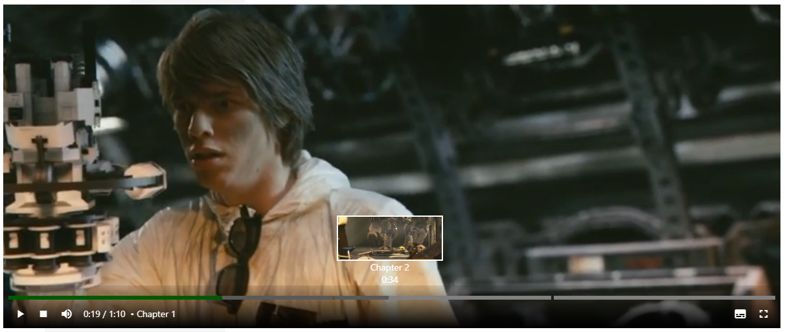

<h1 align="center">Ngx-Video-Player</h1>

  An angular video player component.

Table of Contents

- [About](#about)
- [Getting Started](#getting-started)
  - [Prerequisites](#prerequisites)
  - [Usage](#usage)
- [Roadmap](#roadmap)
- [Contributing](#contributing)
- [Support](#support)
- [License](#license)
- [Acknowledgements](#acknowledgements)

This library was generated with [Angular CLI](https://github.com/angular/angular-cli) version 16.2.0.

## About
</img>

### Main features
- Lightweight ??
- Default controls managing all interactions with the video
- Thumbnail on the video progress, that shows a snapshot, time and chapter for pointed position
- Expose all video attributes
- Expose all video events through event emitters
- Manage the video displayed using [sources] input
- Manage the subtitles using [tracks] input
- Use the [chapters] input to display current media chapter

## Getting Started

## Build
Run `ng build ngx-video-player` to build the project. The build artifacts will be stored in the `dist/` directory.
## Running unit tests

Run `ng test ngx-video-player` to execute the unit tests via [Karma](https://karma-runner.github.io).
